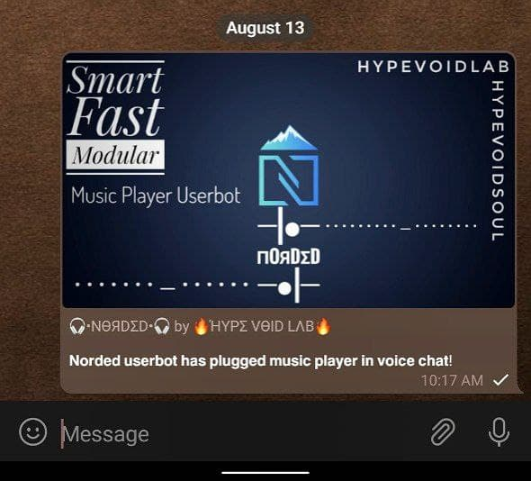
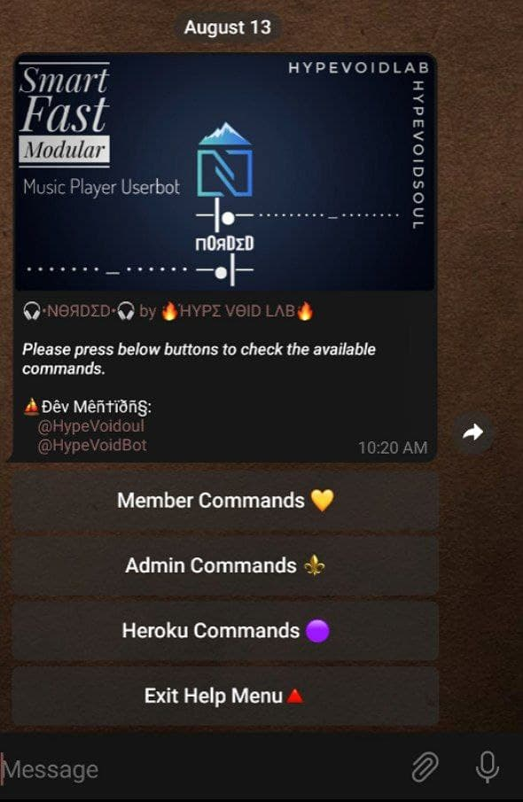
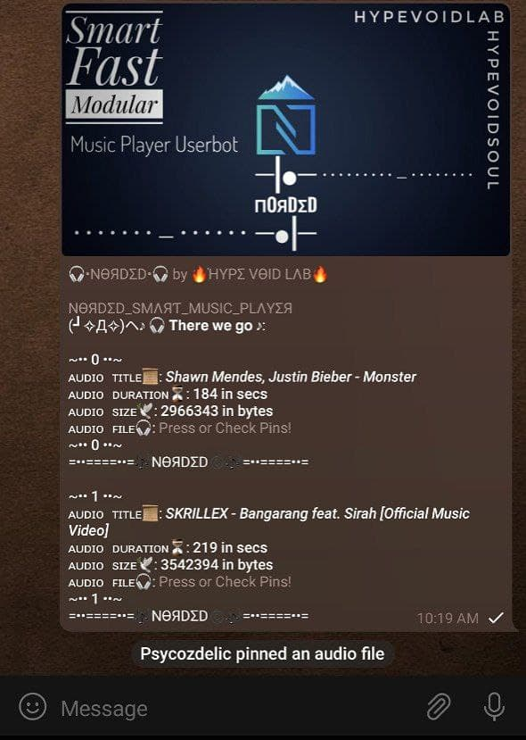
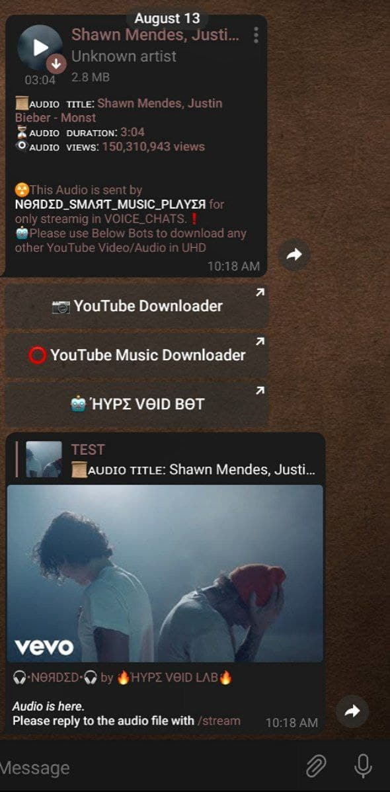

|🔥🔥|======|ΉYPΣ_VӨID_LΛB|======|🔥🔥|
[](https://github.com/ellerbrock/open-source-badges/)
# ⭐️『 𝗧𝗲𝗹𝗲𝗴𝗿𝗮𝗺 𝗠𝘂𝘀𝗶𝗰 𝗕𝗼𝘁 - 🎧𝗡𝗢𝗥𝗗Σ𝗗©️🎧 』⭐️
<p align="centre"></p>


# ❓ WΉY MΛDΣ ƬΉIS BӨƬ?   
```sh
--(••÷[🎧𝗡𝗢𝗥𝗗Σ𝗗©️🎧]÷••--

    💻 𝗪𝗵𝗮𝘁 𝗖𝗮𝗻 𝗕𝗼𝘁 𝗗𝗼???
❄️ 𝘗𝘭𝘢𝘺 𝘢𝘯𝘺 𝘮𝘶𝘴𝘪𝘤 𝘪𝘯 𝘺𝘰𝘶𝘳 𝘨𝘳𝘰𝘶𝘱 𝘷𝘤. 𝘠𝘰𝘶 𝘸𝘪𝘭𝘭 𝘩𝘢𝘷𝘦 𝘵𝘰 𝘣𝘦 𝘰𝘸𝘯𝘦𝘳 𝘵𝘰 𝘶𝘴𝘦 𝘵𝘩𝘪𝘴 𝘣𝘰𝘵 𝘰𝘳 𝘨𝘦𝘵 𝘦𝘳𝘳𝘰𝘳𝘴.

    🔮 𝗩𝗲𝗿𝘀𝗶𝗼𝗻 𝗖𝗵𝗮𝗻𝗴𝗲𝘀??
❄️ 𝘈𝘥𝘥𝘦𝘥 𝘈 𝘯𝘦𝘸 𝘣𝘰𝘵 𝘰𝘱𝘵𝘪𝘰𝘯 𝘵𝘩𝘢𝘵 𝘸𝘪𝘭𝘭 𝘴𝘩𝘰𝘸 𝘢𝘭𝘭 𝘪𝘯𝘧𝘰 𝘯𝘦𝘦𝘥𝘦𝘥 𝘵𝘰 𝘬𝘯𝘰𝘸
❄️ 𝘕𝘦𝘸 𝘋𝘗
❄️ 𝘜𝘱𝘥𝘢𝘵𝘦𝘥 𝘵𝘰 𝘭𝘢𝘵𝘦𝘴𝘵 𝘗𝘺𝘳𝘰𝘨𝘳𝘢𝘮, 𝘛𝘎𝘊𝘳𝘺𝘱𝘵𝘰 𝘢𝘯𝘥 𝘗𝘠𝘛𝘎𝘤𝘢𝘭𝘭𝘴
❄️ 𝘈𝘥𝘥𝘦𝘥 𝘓𝘰𝘨𝘨𝘪𝘯𝘨 𝘝𝘪𝘢 𝘜𝘴𝘦𝘳𝘣𝘰𝘵 & 𝘉𝘰𝘵
❄️ 𝘈𝘥𝘥𝘦𝘥 𝘏𝘦𝘳𝘰𝘬𝘶 𝘚𝘵𝘶𝘧𝘧𝘴 𝘭𝘪𝘬𝘦 𝘜𝘴𝘢𝘨𝘦,𝘳𝘦𝘴𝘵𝘢𝘳𝘵 [𝘣𝘦𝘵𝘢]
❄️ 𝘍𝘶𝘭𝘭𝘺 𝘙𝘦-𝘵𝘩𝘦𝘮𝘦𝘥 𝘢𝘯𝘥 𝘥𝘦𝘣𝘭𝘰𝘢𝘵𝘦𝘥 𝘧𝘳𝘰𝘮 𝘵𝘩𝘦 𝘱𝘳𝘦𝘷𝘪𝘰𝘶𝘴 𝘷𝘦𝘳𝘴𝘪𝘰𝘯𝘴 𝘰𝘧 𝘹𝘦𝘳𝘰𝘯𝘰𝘪𝘥
❄️ 𝐀𝐧𝐝 𝐌𝐚𝐧𝐲 𝐌𝐨𝐫𝐞!
```

# 〽️ MΣΣƬ US ӨЯ CΉΣCK ӨƬΉΣЯ BӨƬS   
- [](https://t.me/XERONOIDBOT)
𝙳𝚒𝚛𝚎𝚌𝚝𝚕𝚢 𝚞𝚜𝚎 𝚃𝚑𝚎 𝙱𝚘𝚝 𝚒𝚗 𝚝𝚎𝚕𝚎𝚐𝚛𝚊𝚖
- [](https://t.me/HypeVoidBot) 𝘛𝘶𝘳𝘯 𝘰𝘯 𝘣𝘰𝘵 𝘪𝘯 𝘵𝘦𝘭𝘦𝘨𝘳𝘢𝘮 𝘢𝘯𝘥 𝘵𝘺𝘱𝘦 /us


# 📷 SCЯΣΣПSΉӨƬS
## 🎧𝗡𝗢𝗥𝗗Σ𝗗©️ Userbot Joined:
<p align="centre"></p>

## 🎧𝗡𝗢𝗥𝗗Σ𝗗©️ Help Query:
<p align="centre"></p>

## 🎧𝗡𝗢𝗥𝗗Σ𝗗©️ Music Player:
<p align="centre"></p>

## 🎧𝗡𝗢𝗥𝗗Σ𝗗©️ YouTube Downloader:
<p align="centre"></p>


# 📂 CӨMMΛNDS
```sh
📌 - *DYNO = Will be asked when deploying and you can 
                    keep any command prefix as per your needs!

•♪•♪𝗠𝗲𝗺𝗯𝗲𝗿_𝗖𝗼𝗺𝗺𝗮𝗻𝗱𝘀•♪•♪
`stream` :•:  𝘙𝘦𝘱𝘭𝘺 𝘵𝘰 𝘢𝘶𝘥𝘪𝘰 𝘧𝘪𝘭𝘦 𝘵𝘰 𝘱𝘭𝘢𝘺/𝘲𝘶𝘦𝘶𝘦 𝘵𝘰 🎧𝗡𝗢𝗥𝗗Σ𝗗_SMΛЯƬ_MUSIC_PLΛYΣЯ©️.
`stream` :•:  𝘜𝘴𝘦 𝘵𝘰 𝘤𝘩𝘦𝘤𝘬𝘰𝘶𝘵 𝘵𝘩𝘦 𝘱𝘭𝘢𝘺𝘭𝘪𝘴𝘵 𝘰𝘧 🎧𝗡𝗢𝗥𝗗Σ𝗗_SMΛЯƬ_MUSIC_PLΛYΣЯ©️.
`ping`   :•:  𝘊𝘩𝘦𝘤𝘬 𝘵𝘩𝘦 𝘱𝘪𝘯𝘨 𝘴𝘵𝘢𝘵𝘶𝘴 𝘰𝘧 🎧𝗡𝗢𝗥𝗗Σ𝗗_SMΛЯƬ_MUSIC_PLΛYΣЯ©️.
`license`:•:  𝘊𝘩𝘦𝘤𝘬 𝘭𝘪𝘤𝘦𝘯𝘴𝘦 𝘰𝘧 🎧𝗡𝗢𝗥𝗗Σ𝗗_SMΛЯƬ_MUSIC_PLΛYΣЯ©️.
`yt`     :•:  Direct youtube music download and play with 🎧𝗡𝗢𝗥𝗗Σ𝗗_SMΛЯƬ_MUSIC_PLΛYΣЯ©️.


•♪•♪𝗔𝗱𝗺𝗶𝗻 𝗖𝗼𝗺𝗺𝗮𝗻𝗱𝘀•♪•♪
`norded`:•: 𝘊𝘩𝘦𝘤𝘬 𝘸𝘩𝘦𝘳𝘦 𝘪𝘴 𝘵𝘩𝘦 —••÷[🕊𝗡𝗢𝗥𝗗Σ𝗗🕊]÷••—𝘶𝘴𝘦𝘳𝘣𝘰𝘵 𝘱𝘭𝘶𝘨𝘨𝘦𝘥.
`plug`  :•: —••÷[🕊𝗡𝗢𝗥𝗗Σ𝗗🕊]÷••—𝘑𝘰𝘪𝘯 𝘨𝘳𝘰𝘶𝘱 𝘷𝘰𝘪𝘤𝘦 𝘤𝘩𝘢𝘵.
`unplug`:•:  𝘓𝘦𝘢𝘷𝘦 𝘵𝘩𝘦 𝘨𝘳𝘰𝘶𝘱 𝘷𝘰𝘪𝘤𝘦 𝘤𝘩𝘢𝘵 𝘸𝘩𝘦𝘳𝘦 —••÷[🕊𝗡𝗢𝗥𝗗Σ𝗗🕊]÷••—𝘸𝘢𝘴 𝘱𝘭𝘢𝘺𝘪𝘯𝘨
`end`   :•:  𝘊𝘭𝘦𝘢𝘯 𝘵𝘩𝘦 𝘱𝘭𝘢𝘺𝘭𝘪𝘴𝘵 𝘢𝘯𝘥 𝘴𝘵𝘰𝘱 𝘢𝘭𝘭 𝘮𝘶𝘴𝘪𝘤.
`pause` :•:  𝘗𝘢𝘶𝘴𝘦 𝘮𝘶𝘴𝘪𝘤 𝘪𝘯 𝘨𝘳𝘰𝘶𝘱 𝘷𝘰𝘪𝘤𝘦 𝘤𝘩𝘢𝘵.
`resume`:•:  𝘜𝘯-𝘱𝘢𝘶𝘴𝘦 𝘵𝘩𝘦 𝘮𝘶𝘴𝘪𝘤 𝘪𝘯 𝘨𝘳𝘰𝘶𝘱 𝘷𝘰𝘪𝘤𝘦 𝘤𝘩𝘢𝘵.
`replay`:•:  𝘗𝘭𝘢𝘺 𝘧𝘳𝘰𝘮 𝘵𝘩𝘦 𝘣𝘦𝘨𝘪𝘯𝘯𝘪𝘯𝘨 𝘰𝘨 𝘤𝘶𝘳𝘳𝘦𝘯𝘵 𝘮𝘶𝘴𝘪𝘤 𝘣𝘦𝘪𝘯𝘨 𝘱𝘭𝘢𝘺𝘦𝘥.
`next`  :•:  𝘔𝘰𝘷𝘦 𝘵𝘰 𝘵𝘩𝘦 𝘯𝘦𝘹𝘵 𝘵𝘳𝘢𝘤𝘬 𝘰𝘳 𝘚𝘬𝘪𝘱 𝘵𝘳𝘢𝘤𝘬 𝘪𝘯 𝘲𝘶𝘦𝘶𝘦 𝘭𝘪𝘬𝘦 : "𝘯𝘦𝘹𝘵 2".
`temp`  :•:  𝘊𝘭𝘦𝘢𝘯 𝘵𝘦𝘮𝘱 𝘢𝘶𝘥𝘪𝘰 𝘧𝘪𝘭𝘦𝘴 𝘪𝘯 𝘴𝘦𝘳𝘷𝘦𝘳 𝘰𝘧 🎧𝗡𝗢𝗥𝗗Σ𝗗_SMΛЯƬ_MUSIC_PLΛYΣЯ©️.


•♪•♪𝗛𝗲𝗿𝗼𝗸𝘂 𝗔𝗱𝗺𝗶𝗻 𝗖𝗼𝗺𝗺𝗮𝗻𝗱𝘀•♪•♪
`shutdown`:•: 𝘛𝘶𝘳𝘯 𝘰𝘧𝘧 𝘏𝘌𝘙𝘖𝘒𝘜 𝘋𝘺𝘯𝘰 𝘧𝘰𝘳 🎧𝗡𝗢𝗥𝗗Σ𝗗_SMΛЯƬ_MUSIC_PLΛYΣЯ©️.
`restart` :•: 𝘙𝘦𝘣𝘰𝘰𝘵 —••÷[🕊𝗡𝗢𝗥𝗗Σ𝗗🕊]÷••—𝘮𝘢𝘯𝘶𝘢𝘭𝘭𝘺 𝘪𝘯 𝘏𝘌𝘙𝘖𝘒𝘜.
`usage`   :•: 𝘍𝘪𝘯𝘥 —••÷[🕊𝗡𝗢𝗥𝗗Σ𝗗🕊]÷••—𝘏𝘌𝘙𝘖𝘒𝘜 𝘥𝘺𝘯𝘰 𝘶𝘴𝘢𝘨𝘦
```


# 📜 PЯΣRΣQUISIƬΣS
```sh
𝐈𝐟 𝐮𝐬𝐢𝐧𝐠 𝐇𝐞𝐫𝐨𝐤𝐮:
    -   BOT_TOKEN = From @BotFather Only
    -   API_TOKEN = From @HVApiBot Only
    -   API_HASH  = From @HVApiBot Only
    -   XERONOID_SESSION = Get it from below replit link
    -   OWNER_USERNAME = Your Username like @HypeVoids
    -   HEROKU_APP_NAME = Name of your heroku app
    -   HEROKU_API_KEY = Your Heroku API_TOKEN 
    -   BOT_USERNAME = Your Bot @Username
    -   DYNO = Keep any command prefix as per your needs!
    -   CLEANER = Put the value to auto clean the notifications by 🎧𝗡𝗢𝗥𝗗Σ𝗗©️🎧
    -   CHAT_ID = Group chat IDs where your 🎧𝗡𝗢𝗥𝗗Σ𝗗©️🎧 player can play music.
Put like this > -1001526909798 -1001472203238 -1001509210199 [with a space between]
    -   NORD_ADMINS = User IDs of the Admins you want can use 𝗔𝗱𝗺𝗶𝗻 𝗖𝗼𝗺𝗺𝗮𝗻𝗱𝘀 of Xeronoid.
Put like this > 1868088205 1941593018 [with a space between]


𝗜𝗳 𝘂𝘀𝗶𝗻𝗴 𝗦𝗲𝗹𝗳 𝗛𝗼𝘀𝘁𝗶𝗻𝗴:
    -   BOT_TOKEN = From @BotFather Only
    -   API_TOKEN = From @HVApiBot Only
    -   API_HASH  = From @HVApiBot Only
    -   XERONOID_SESSION = Get it from below replit link
    -   OWNER_USERNAME = Your Username like @HypeVoids
    -   BOT_USERNAME = Your Bot @Username
    -   DYNO = Keep any command prefix as per your needs!
    -   CLEANER = Put the value to auto clean the notifications by 🎧𝗡𝗢𝗥𝗗Σ𝗗©️🎧
    -   CHAT_ID = Group chat IDs where your 🎧𝗡𝗢𝗥𝗗Σ𝗗©️🎧 player can play music.
Put like this > -1001526909798 -1001472203238 -1001509210199 [with a space between]
    -   NORD_ADMINS = User IDs of the Admins you want can use 𝗔𝗱𝗺𝗶𝗻 𝗖𝗼𝗺𝗺𝗮𝗻𝗱𝘀 of Xeronoid.
Put like this > 1868088205 1941593018 [with a space between]
```


# 💠 DΣPLӨY  
- ꜰɪʀꜱᴛ ꜰᴏʀᴋ ᴀɴᴅ ꜱᴛᴀʀ ᴛʜᴇ ʀᴇᴘᴏ ᴀɴᴅ ᴛʜᴇɴ ᴄʜᴀɴɢᴇ [app.bot](app.bot) ᴛᴏ app.json

- [](https://heroku.com/deploy?template=https://github.com/HypeVoidSoul/Norded.git/tree/VOID) 𝘌𝘯𝘢𝘣𝘭𝘦 𝘵𝘩𝘦 𝘥𝘺𝘯𝘰 𝘪𝘯 𝘩𝘦𝘳𝘰𝘬𝘶 𝘪𝘧 𝘶 𝘥𝘦𝘱𝘭𝘰𝘺𝘦𝘥 𝘶𝘳 𝘣𝘰𝘵 𝘪𝘯 𝘏𝘦𝘳𝘰𝘬𝘶

- [](https://t.me/XERONOIDBOT)


# 📜 LICΣПSΣ    
-  𝗧𝗲𝗹𝗲𝗴𝗿𝗮𝗺 𝗠𝘂𝘀𝗶𝗰 𝗕𝗼𝘁 - 𝗡𝗢𝗥𝗗Σ𝗗 𝘪𝘴 𝘭𝘪𝘤𝘦𝘯𝘴𝘦𝘥 𝘶𝘯𝘥𝘦𝘳 𝘵𝘩𝘦 𝘎𝘕𝘜 𝘎𝘦𝘯𝘦𝘳𝘢𝘭 𝘗𝘶𝘣𝘭𝘪𝘤 𝘓𝘪𝘤𝘦𝘯𝘴𝘦 𝘷3.0[GNU V3.0](LICENSE)

```sh
➕➕➕➕➕➕➕➕➕➕➕➕➕➕➕➕➕➕➕➕➕➕➕➕➕➕➕➕➕➕➕➕➕
                            GNU GENERAL PUBLIC LICENSE 
                            Version 3, 29 June 2007
                    Copyright (C) 2007 Free Software Foundation
                Everyone is permitted to 𝗰𝗼𝗽𝘆 𝗮𝗻𝗱 𝗱𝗶𝘀𝘁𝗿𝗶𝗯𝘂𝘁𝗲 verbatim copies
                    of this license document, 𝗯𝘂𝘁 𝗰𝗵𝗮𝗻𝗴𝗶𝗻𝗴 𝗶𝘁 𝗶𝘀 𝗻𝗼𝘁 𝗮𝗹𝗹𝗼𝘄𝗲𝗱.
                                🎧𝗡𝗢𝗥𝗗Σ𝗗©️🎧   
                        Telegram Music player userbot 
                has been licensed under GNU General Public License
                    𝐂𝐨𝐩𝐲𝐫𝐢𝐠𝐡𝐭 (𝐂) 𝟐𝟎𝟐𝟏 𝗛𝘆𝗽𝗲𝗩𝗼𝗶𝗱𝗦𝗼𝘂𝗹 | 𝗛𝘆𝗽𝗲𝗩𝗼𝗶𝗱𝗟𝗮𝗯 | 𝗛𝘆𝗽𝗲𝗩𝗼𝗶𝗱𝘀
➕➕➕➕➕➕➕➕➕➕➕➕➕➕➕➕➕➕➕➕➕➕➕➕➕➕➕➕➕➕➕➕➕     
```
|🔥🔥|======|ΉYPΣ_VӨID_LΛB|======|🔥🔥|
